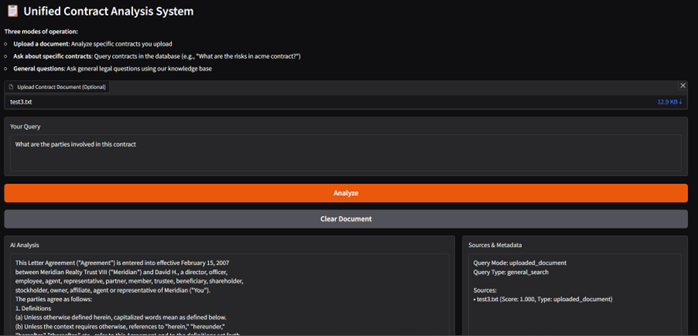
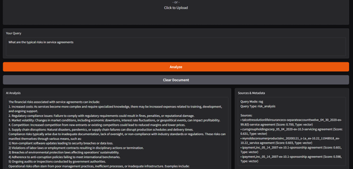

# Unified Contract Analysis System

This project provides a comprehensive pipeline for extracting, processing, embedding, and analyzing legal contracts using advanced NLP and vector search techniques. It enables users to upload contracts, query a database of contracts, and perform detailed legal analysis through an intuitive Gradio web interface. The system integrates hybrid search capabilities, combining vector-based semantic search, metadata filtering, and BM25 keyword search for robust and accurate results.

## Features

- **Contract Extraction and Chunking:**  
  Extracts text and metadata from PDF and TXT contract files using [unstructured.io](https://unstructured.io/) and splits them into semantically meaningful chunks for efficient processing and search.

- **Embedding and Vector Database (Pinecone):**  
  Generates embeddings for contract chunks and metadata using the [sentence-transformers/all-mpnet-base-v2](https://huggingface.co/sentence-transformers/all-mpnet-base-v2) model. These embeddings are stored in a Pinecone vector database with separate namespaces for chunks (`contract_chunks`) and metadata (`contract_metadata`) to enable fast similarity searches.

- **Hybrid Search Engine:**  
  Combines three search modalities for robust contract retrieval:
  - **Vector Search:** Semantic similarity search using embeddings for contextual relevance.
  - **BM25 Keyword Search:** Keyword-based search for precise term matching.
  - **Metadata Search:** Targeted queries on contract metadata for high-level insights.

- **Query Classification and Contextual Analysis:**  
  Automatically classifies user queries into five types using keyword-based analysis:
  - **Risk Analysis**: Identifies financial, compliance, operational, legal, and data privacy risks.
  - **lause Extraction**: Extracts and analyzes key terms, obligations, and clauses.
  - **Compliance Check**: Evaluates adherence to legal and regulatory standards.
  - **Comparison**: Compares contract terms across documents.
  - **General Search**: Provides comprehensive insights for broad legal queries.

- **Intelligent Query Handling:**  
  Determines the appropriate query mode based on context:
  - **Uploaded Document Mode**: Analyzes user-uploaded contracts.
  - **Specific Contract Mode**: Searches for named contracts in the database.
  - **RAG Mode**:  Answers general legal questions using the Retrieval-Augmented Generation (RAG) system.

- **Gradio Web Interface:**  
  Provides a user-friendly interface for uploading PDF or TXT contract files, querying specific contracts in the database, or asking general legal questions. Results include AI-generated analyses with cited sources and metadata.

- **AI-Powered Analysis:**  
  Uses the Qwen2.5-0.5B model for generating detailed, context-aware responses tailored to the query type, with structured outputs and specific clause references.

- **Test Data:**  
  Includes three sample contracts (`test1.txt`, `test2.txt`, `test3.txt`) from the [contract-nli](https://huggingface.co/datasets/contract-nli) dataset for testing and demonstration purposes.

## Directory Structure

```
chunks_with_metadata.pkl
contract_generate_chunks_and_save.ipynb
contract_pinecone_upserting.ipynb
contract_system_final.ipynb
master_clauses_cleaned-modified.xlsx
ui-1.png
ui-2.png
data/
    full_contract_pdf.zip
    full_contract_pdf/
        ... (PDF contracts)
    full_contract_txt/
        ... (TXT contracts)
test-data/
    test1.txt
    test2.txt
    test3.txt
```

## Setup & Usage

### Install Dependencies

Requires Python 3.8+.

Install required packages using:
```
pip install -r requirements.txt
```
Key dependencies: `sentence-transformers`, `pinecone`, `rank-bm25`, `gradio`, `pdfplumber`, `pandas`, `unstructured`, `transformers`, `torch`.

### Prepare Data

- Place contract PDFs in `data/full_contract_pdf/` and TXT files in `data/full_contract_txt/`.
- Run `contract_generate_chunks_and_save.ipynb` to extract text, generate chunks, and save them as `chunks_with_metadata.pkl`.

### Upsert to Pinecone

- Set up your Pinecone API key and index name in `contract_pinecone_upserting.ipynb`.
- Run the notebook to embed and upsert contract chunks and metadata into the Pinecone index.

### Run the Unified System

- Launch `contract_system_final.ipynb` to initialize the system and start the Gradio interface.
- Use the interface to upload contracts, query specific contracts in the database, or ask general legal questions.

## Test Data

The `test-data/` folder contains three sample contracts (`test1.txt`, `test2.txt`, `test3.txt`) sourced from the contract-nli dataset. These files are ideal for testing the system's extraction, chunking, and analysis capabilities.

## UI Screenshots

### 
*Description:*  
The main Gradio interface, allowing users to upload a contract document, input a query, and view the AI-generated analysis with cited sources.

### 
*Description:*  
The results section, displaying the AI's detailed analysis, relevant contract chunks, and metadata overview for the user's query.

## Notebooks Overview

- **contract_generate_chunks_and_save.ipynb:**  
  Extracts text and metadata from contracts, chunks them using unstructured.io, and saves the processed data as `chunks_with_metadata.pkl`.

- **contract_pinecone_upserting.ipynb:**  
  Generates embeddings for contract chunks and metadata using sentence-transformers/all-mpnet-base-v2 and upserts them into Pinecone for vector search.

- **contract_system_final.ipynb:**  
  Implements the unified contract analysis system, including the hybrid search engine, query classification, AI response generation, and Gradio interface.

## Data Sources

- **Contracts:**  
  Sourced from open datasets such as CUAD and contract-nli.

- **Test Contracts:**  
  Provided in the `test-data/` folder from the contract-nli dataset.

## How It Works

1. **Extraction and Chunking:**  
   Contracts are parsed and split into meaningful chunks with associated metadata using unstructured.io.

2. **Embedding:**  
   Chunks and metadata are embedded using the sentence-transformers/all-mpnet-base-v2 model for semantic representation.

3. **Upserting to Pinecone:**  
   Embeddings are stored in a Pinecone vector database with separate namespaces for chunks and metadata to enable efficient retrieval.

4. **Query Classification:**  
   User queries are classified into risk analysis, clause extraction, compliance check, comparison, or general search based on keyword patterns.

5. **Hybrid Search and Analysis:**  
   The system performs hybrid search (vector, metadata, BM25) and generates context-aware responses using the Qwen2.5-0.5B model, tailored to the query type and mode (uploaded document, specific contract, or general RAG).

6. **Gradio Interface:**  
   Users can interact with the system via a web interface to upload contracts, query the database, or ask general questions, with results displayed alongside sources and metadata.

## Example Queries

**Uploaded Document Queries:**
- "What are the main risks in this contract?"
- "Extract all termination clauses from this document"

**Specific Contract Queries:**
- "What are the parties involved in acme contract?"
- "Show me liability clauses in microsoft contract"
- "Analyze the adamsgolf contract"

**General Questions:**
- "What are typical risks in service agreements?"
- "What are typical termination clauses?"
- "What should I look for in liability clauses?"

## Technical Details

- **Embedding Model:** Uses sentence-transformers/all-mpnet-base-v2 for generating high-quality embeddings.
- **Vector Database:** Pinecone with two namespaces: `contract_chunks` for text chunks and `contract_metadata` for high-level metadata.
- **LLM:** Qwen2.5-0.5B for generating detailed, context-aware responses with custom system prompts per query type.
- **Search Engine:** Combines vector search (cosine similarity), BM25 keyword search, and metadata filtering with normalized scoring and result deduplication.
- **Hardware Support:** Optimized for GPU acceleration (e.g., NVIDIA Tesla T4) but falls back to CPU if needed.
- **Query Processing:** Enhanced with regex-based contract identifier extraction and context-aware mode selection (uploaded document, specific contract, general RAG).

## License

This project is intended for academic and research purposes only. Please review the licenses of the source datasets (CUAD, contract-nli) for their respective terms of use.